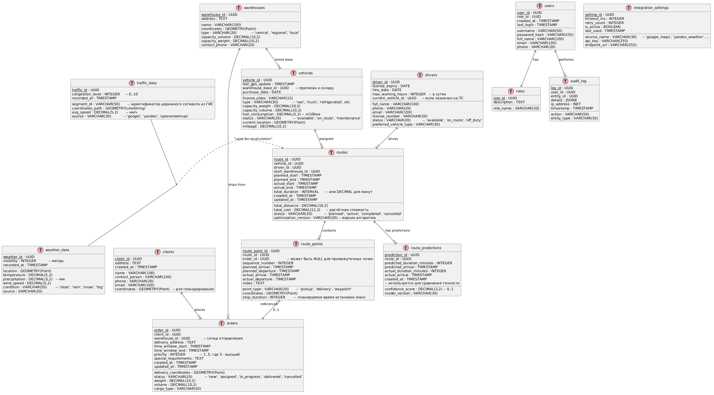
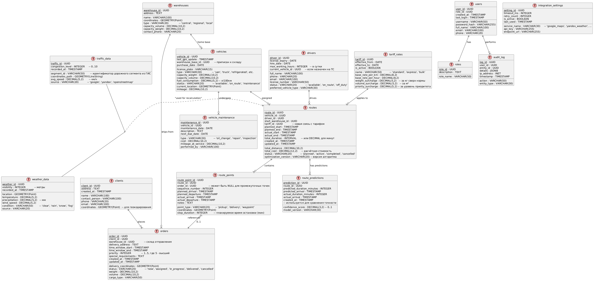

### Цель работы

Разработка и обоснование реляционной структуры базы данных для компонента «Оптимизация маршрутов доставки» интеллектуальной логистической системы TransLogix. Целевая структура данных должна обеспечить централизованное хранение информации о заказах, транспортных средствах, водителях и маршрутах, а также интеграцию с внешними источниками данных (погода, пробки) для поддержки алгоритмов машинного обучения. Конечная цель — создание логической ER-модели, позволяющей повысить точность прогнозов времени доставки (не менее 95%) и сократить время расчёта маршрутов за счёт оптимальной нормализации данных и учёта динамических факторов.

### Постановка задачи

Для достижения поставленной цели в рамках проектирования базы данных необходимо решить следующие задачи:

1. **Анализ предметной области** — изучить бизнес-процессы системы TransLogix (планирование, мониторинг, аналитика) и выделить ключевые сущности, участвующие в маршрутизации (заказы, склады, ТС, водители, внешние факторы).

2. **Проектирование логической схемы данных** — разработать ER-диаграмму с нотацией «вороньи лапки», определить первичные и внешние ключи, а также задать типы данных (включая геометрические `GEOMETRY` для пространственных запросов и `JSONB` для гибкого логирования).

3. **Обеспечение целостности связей** — формализовать отношения между сущностями (один-ко-многим, один-к-одному), гарантируя каскадную согласованность маршрутов, точек доставки и назначений водителей.

4. **Расширение структуры для ML-алгоритмов** — внедрить дополнительные сущности (`delivery_zones` для кластеризации, `route_predictions` для хранения истории прогнозов, `vehicle_maintenance` для учёта состояния ТС), чтобы обеспечить алгоритмы графов и регрессии актуальными входными данными.

5. **Интеграция с внешними источниками** — спроектировать таблицы для кэширования и истории данных о дорожной обстановке (`traffic_data`) и погоде (`weather_data`), а также настроечную таблицу (`integration_settings`) для подключения к картографическим API (Google Maps, Яндекс.Карты).

### Промпт для генерации скрипта

```
С помощью скрипта PlantUML сгенерировать схему реляционной базы данных информационной системы TransLogix.

Нужно сгенерировать скрипт PlantUML для ER-диаграммы, который не будет противоречить информационной схеме.Диаграмма должна быть дополнена описанием сущностей и связей. 

Описание TransLogix: Интеллектуальная логистическая система, оптимизирующая маршруты доставки и управление складскими запасами с помощью искусственного интеллекта.
```

И приложил файл ТЗ из задания 3.

### Полученный скрипт

<details>
  <summary>Сгенерированный скрипт</summary>

  ```
@startuml
!define table(x) class x << (T,#FFAAAA) >>
!define pk(x) <u>x</u>
!define fk(x) x

' --- СУЩНОСТИ ---

table(users) {
  pk(user_id) : UUID
  username : VARCHAR(50)
  password_hash : VARCHAR(255)
  full_name : VARCHAR(100)
  email : VARCHAR(100)
  phone : VARCHAR(20)
  role_id : UUID
  created_at : TIMESTAMP
  last_login : TIMESTAMP
}

table(roles) {
  pk(role_id) : UUID
  role_name : VARCHAR(50)
  description : TEXT
}

table(clients) {
  pk(client_id) : UUID
  name : VARCHAR(100)
  contact_person : VARCHAR(100)
  phone : VARCHAR(20)
  email : VARCHAR(100)
  address : TEXT
  coordinates : GEOMETRY(Point)  -- для геокодирования
  created_at : TIMESTAMP
}

table(warehouses) {
  pk(warehouse_id) : UUID
  name : VARCHAR(100)
  address : TEXT
  coordinates : GEOMETRY(Point)
  type : VARCHAR(20)             -- 'central', 'regional', 'local'
  capacity_volume : DECIMAL(10,2)
  capacity_weight : DECIMAL(10,2)
  contact_phone : VARCHAR(20)
}

table(orders) {
  pk(order_id) : UUID
  client_id : UUID
  warehouse_id : UUID            -- склад отправления
  delivery_address : TEXT
  delivery_coordinates : GEOMETRY(Point)
  time_window_start : TIMESTAMP
  time_window_end : TIMESTAMP
  priority : INTEGER             -- 1..5, где 5 – высший
  status : VARCHAR(20)           -- 'new', 'assigned', 'in_progress', 'delivered', 'cancelled'
  weight : DECIMAL(10,2)
  volume : DECIMAL(10,2)
  cargo_type : VARCHAR(50)
  special_requirements : TEXT
  created_at : TIMESTAMP
  updated_at : TIMESTAMP
}

table(vehicles) {
  pk(vehicle_id) : UUID
  license_plate : VARCHAR(15)
  type : VARCHAR(30)             -- 'van', 'truck', 'refrigerated', etc.
  capacity_weight : DECIMAL(10,2)
  capacity_volume : DECIMAL(10,2)
  fuel_consumption : DECIMAL(5,2) -- л/100км
  status : VARCHAR(20)           -- 'available', 'on_route', 'maintenance'
  current_location : GEOMETRY(Point)
  last_gps_update : TIMESTAMP
  warehouse_base_id : UUID      -- приписан к складу
  purchase_date : DATE
  mileage : DECIMAL(10,2)
}

table(drivers) {
  pk(driver_id) : UUID
  full_name : VARCHAR(100)
  phone : VARCHAR(20)
  email : VARCHAR(100)
  license_number : VARCHAR(50)
  license_expiry : DATE
  hire_date : DATE
  status : VARCHAR(20)           -- 'available', 'on_route', 'off_duty'
  max_working_hours : INTEGER   -- в сутки
  preferred_vehicle_type : VARCHAR(30)
  current_vehicle_id : UUID     -- если назначен на ТС
}

table(routes) {
  pk(route_id) : UUID
  vehicle_id : UUID
  driver_id : UUID
  start_warehouse_id : UUID
  planned_start : TIMESTAMP
  planned_end : TIMESTAMP
  actual_start : TIMESTAMP
  actual_end : TIMESTAMP
  total_distance : DECIMAL(10,2)
  total_duration : INTERVAL      -- или DECIMAL для минут
  total_cost : DECIMAL(12,2)     -- расчётная стоимость
  status : VARCHAR(20)           -- 'planned', 'active', 'completed', 'cancelled'
  created_at : TIMESTAMP
  updated_at : TIMESTAMP
  optimization_version : VARCHAR(20) -- версия алгоритма
}

table(route_points) {
  pk(route_point_id) : UUID
  route_id : UUID
  order_id : UUID                -- может быть NULL для промежуточных точек
  sequence_number : INTEGER
  point_type : VARCHAR(20)       -- 'pickup', 'delivery', 'waypoint'
  coordinates : GEOMETRY(Point)
  planned_arrival : TIMESTAMP
  planned_departure : TIMESTAMP
  actual_arrival : TIMESTAMP
  actual_departure : TIMESTAMP
  stop_duration : INTEGER        -- планируемое время остановки (мин)
  notes : TEXT
}

table(traffic_data) {
  pk(traffic_id) : UUID
  segment_id : VARCHAR(50)       -- идентификатор дорожного сегмента из ГИС
  coordinates_path : GEOMETRY(LineString)
  avg_speed : DECIMAL(5,2)       -- км/ч
  congestion_level : INTEGER     -- 0..10
  recorded_at : TIMESTAMP
  source : VARCHAR(20)           -- 'google', 'yandex', 'openstreetmap'
}

table(weather_data) {
  pk(weather_id) : UUID
  location : GEOMETRY(Point)
  temperature : DECIMAL(5,2)
  precipitation : DECIMAL(5,2)   -- мм
  wind_speed : DECIMAL(5,2)
  visibility : INTEGER           -- метры
  condition : VARCHAR(50)        -- 'clear', 'rain', 'snow', 'fog'
  recorded_at : TIMESTAMP
  source : VARCHAR(20)
}

table(route_predictions) {
  pk(prediction_id) : UUID
  route_id : UUID
  predicted_duration_minutes : INTEGER
  predicted_arrival : TIMESTAMP
  confidence_score : DECIMAL(3,2) -- 0..1
  actual_duration_minutes : INTEGER
  actual_arrival : TIMESTAMP
  model_version : VARCHAR(30)
  created_at : TIMESTAMP
  -- используется для сравнения точности
}

table(integration_settings) {
  pk(setting_id) : UUID
  service_name : VARCHAR(30)     -- 'google_maps', 'yandex_weather', ...
  api_key : VARCHAR(255)
  endpoint_url : VARCHAR(255)
  timeout_ms : INTEGER
  retry_count : INTEGER
  is_active : BOOLEAN
  last_used : TIMESTAMP
}

table(audit_log) {
  pk(log_id) : UUID
  user_id : UUID
  action : VARCHAR(50)
  entity_type : VARCHAR(30)
  entity_id : UUID
  details : JSONB
  ip_address : INET
  timestamp : TIMESTAMP
}

' --- СВЯЗИ ---

users ||--|| roles : "has"
users ||--o{ audit_log : "performs"

clients ||--o{ orders : "places"
warehouses ||--o{ orders : "ships from"

warehouses ||--o{ vehicles : "home base"
vehicles ||--o{ routes : "assigned"
drivers ||--o{ routes : "drives"
routes ||--o{ route_points : "contains"
route_points }o--|| orders : "references"   (0..1)

routes ||--o{ route_predictions : "has predictions"

' Интеграционные таблицы (связи не жёсткие)
(traffic_data, weather_data) ..|| routes : "used for recalculation"

@enduml
  ```
</details>

### Диаграмма (визуализация скрипта в Plant UML)

[Диаграмма](https://www.processon.io/plantuml?editor_content=gnC9STaH5skh5vdzl3BredwnXh4baBgtUaoG9rtYzrljGU7PxLdZz1dk7OYVFbdngoXWukv103J7MmxL1Ux8KFOKniI06MSHiY4ZgEQZGxDyqPHgyrF64WlPaajTOUfHwMM7JvCQbJESyd9QliZCK8WoKOxrhDZRZo7y6673svd81VMDsFPNDEwzuCfBJ27txwE37NfExTwWvfkJpWS6KTKJbJG4PTv2LmlLir4dpyZHJuA3E3iqKMs42EiNmDIidK3bkkMbQRo85UOJxeKbdbfSHIDgvxR8wqCwH3m7pmyUbbP1RVZDAjDQpn0m0GoHBPZ89eiv9kC1B7wegyw2BfPvKBPoLWXzCfFqW4dea4geCbF9yOPaCHJ7alJNIM22CTGwqyILOWNHYfKgoEZWV883y5MNwI2NEkWeOVQG1u6diGHVPQcC9EpthFFSbvfmZFSqY1dOQKtWLoi5DQM1DIvgBuTTrcFX7fVof8jknhH4umHTZ3eutLI1okBX9wJTvOEcqere3Bzancp2Tu5oE4OI8DLSowa3JeWLIG8MTzJXFf8sOQPdvpLmOKh0e8P6tbJo13nHWHoti4XVJ68iq74Mrfs1UtubIcP221hAVQq3WrOIn64upG22UXPHJeiTnpezam1QNDMCvstQaqobGLNHnSwoeXJqXlCVaKGAem3WI9Uxr5wW1ORzlRCWQyf24LlJ65mm7ZuNgKutjZGAafzZFzPECsv6Y2FPYAwKbE6qSwIZkMK2i7d70f5AjknYBndUhCdFb6ps6zPKHitXa9182UVcDWZzTj7WdxtnqD36cTUoFXjKoTjHuM5MXENBSqWJZUmR7PNYTqCfR0yVOWfueSPfrC0RR8XruMVDPYWYEimkjTdQ6wKISwdFpfXD1rN37VHmvRdxlbSzAREV6ZfLhgbi3CUbqDVHJyCABaeYokR24zjS84oGndW31nEji0qB3nlJsMvzbLgzyodYIHhv70zIT8Qg10JhfwF5vkTsjTTeuhynJE8WiHgrjtIXePmxJGCRJsw3oA8xPNYcfNjhDT62CsPhjTQfrVF4KnevioBSUKlA6zPGGwFJUYO6IZWFaDuWQyZzKOX7KyJGkPlKHHl6brbpCUKrJYxSBjZHUDzVlELHkYfs5B1SpyJcp1saULNPftAxyyYTU2VqD7510anVi3ho1UTlaeu630c4ouVVbo0XMmYZNpUGjhxhRRyICZ2hBq6T5s8fQnD6VhPdz3tymuMVwoNUK7fOWlaNeNxOTRAOmqloOP1XGmNoFoT3cJS5ZI0lpHIdR8AHgukKhmdWphzO1I2IL2MSj66vHVidD0jOZJ53pDovZa2ZXeh889VDVeq61oTDoNAYZThuEZDckOV5iDBUn1HrkepplGJLD1obT87VUN1JuvXhwNydecWIcEvmnS4GXfROLS28d70wmwC9X9NOstF08o4AlwdgG8iUbhxPZrxmi6VcaM8XVAM4V5vZSF8QIbhACAfYT3UnECtHLAgzlXRZSObLCUyHdUL7rahYszZnRnbi5ZngU2vreCx6OP3TY8p8XAirJaekRLw6p0vLQdHiuNkXsS8Zyy0P7kYNpIcCgsWetDYv5mIkZIomAACnVfHoFEl8LwPtGVG6XWQUEC3aHKRNSSBQGh5PIBCG0jblihejPJKsAPbeZsjFJBT06Pj7gPvBmIYqCTJDVWsAZq5ti3jLraVBXEPbDC0HC9YckNLX2ZEvVZRD7BlSCFEoFh8g7TRFmBDvUre91MqMPHDhogk9S7GhQmf39knNYiwY6DoeSJdUuu7IyfTJNbT1UuVL8N6QXShvVEptqlkO77pTbPzUMFPkUb6CTzjtvlYipMfXeewPzQbvYRrWScpmpbHJkZuWVgQe3CaLOwVWw2Sz6orzrMrda5Q6iZgQbiVdPoEcLVE4CefT3lI1d9wvMaJKwwvB1SqZWbvBlB21PyxvnsO7XBynVNJwNbFLetDXQxDvwJnbXinS0MlVy6CHqqa12hSGao7Wa6BNmJJ5yhtwDx4iIkQOd01WMiu9kxBRQeXM0qWY4FwX3q70BuSuF6QjPlk2GxEigJmwlmb3dKlVoTkRmK2vmgdfYM5dK30n82WetRBunfDeatxGCqWMrYwacZptBif7Zz9LYclVPh0ZDCSe1KtcvONToUEoPwpoq1HqX1UZ1243h0aDh9uw8LoMG6NkfWGHqJNCwcohUSebDYwjVyM7AXf3H7BOaq6A1mC4qe920gAIYqoW7uJO91HKgJlIyv64VIGLjTnyrwkusclKvNFTYZ3wGYQTtn93MJmOaLsMQ5HVBmOsH0gv96fmXxBuXzJLcknwQSklMPHIEfsP34wGDzl4LZVFilBOVTnYb8paKRhk3okHSqWVND8dGlCEDr6UEFlMiYeKWAjxQga9ohUL4dgT0vkcxxMWy1Hf2NbpiB6Qi0sTpCf8xXmAifVzpVR1FiqPMMpkBolgJWB7Uuq8ixLdnF45IBV8vImxaxzcmUV9Pj5GuveDp2r4wp5iln4Nsxo8WAx3EcYhcnaVQRzyDBUW2VKsES2JvTxhu71XILgkT8oXZDc7yyhxGH9A6RDssuhscNvNKVkUCXv8rTM7Cp48ojklLPSvg2GhDwm1gMXWeUiJW2oC1UnMIqJsabMH8tK6nhyDG9zP4bu572xBv55r7PCw9RDFCfpNHa1CWC4i1nafPca1DhMQhyd7timVAsxXzLDPbneoY2EimsDx0HDrvQl5yvTcLqOSffH9Qm4xRvwyCDUq9aAQJQp9Qflwqcny7jYGdlcSfbGoNwof)



### Описание диаграммы

#### 1. **users** – пользователи системы (логисты, диспетчеры, курьеры)  
- Хранит учётные данные, ФИО, контакты.  
- Связана с **roles** (многие‑к‑одному) для разграничения прав доступа.

#### 2. **roles** – роли пользователей  
- Определяет функциональные роли (администратор, диспетчер, логист, курьер).

#### 3. **clients** – клиенты, получающие доставку  
- Хранит контактную информацию и геокоординаты адреса.  
- Связан с **orders** (один клиент → много заказов).

#### 4. **warehouses** – склады  
- Содержит данные о складах (адрес, координаты, вместимость).  
- Выступает в качестве точки отправления для заказов и базового места для транспортных средств.

#### 5. **orders** – заказы на доставку  
- Ключевая сущность: содержит адрес доставки, временное окно, приоритет, вес, объём, тип груза, статус.  
- Связан с **clients** (заказчик) и **warehouses** (склад отправления).  
- Может быть включён в маршрут через **route_points** (связь «один заказ может присутствовать в одном маршруте в рамках одной точки», но в реальности заказ может быть перепланирован; на диаграмме показана связь 0..1 к route_points).

#### 6. **vehicles** – транспортные средства  
- Содержит характеристики: тип, грузоподъёмность, расход топлива, текущее местоположение.  
- Привязан к **warehouses** (базовый склад).  
- Назначается на **routes** (одно ТС может участвовать в нескольких маршрутах, но обычно один активный маршрут за раз).

#### 7. **drivers** – водители  
- Хранит лицензионные данные, статус, предпочтения по ТС.  
- Может быть привязан к текущему ТС (current_vehicle_id) и к маршрутам через **routes**.

#### 8. **routes** – маршруты доставки  
- Основной элемент оптимизации: содержит плановое и фактическое время, общую дистанцию, стоимость, статус.  
- Связан с **vehicles**, **drivers** и **warehouses** (стартовый склад).  
- Состоит из множества точек (route_points).  
- Для каждого маршрута могут храниться прогнозы времени доставки в **route_predictions**.

#### 9. **route_points** – точки маршрута (последовательность доставок)  
- Определяет порядок посещения заказов (order_id) или промежуточных точек.  
- Содержит плановое и фактическое время прибытия/отправления.  
- Связывает **routes** и **orders** (многие‑к‑одному: одна точка может ссылаться на один заказ).

#### 10. **traffic_data** и **weather_data** – кэш/история внешних данных  
- Используются для динамической корректировки маршрутов.  
- Не имеют жёсткой ссылки на маршруты (логически «используются при пересчёте»).

#### 11. **route_predictions** – прогнозы времени доставки  
- Хранит предсказанные и фактические значения для оценки точности модели (метрика ≥95%).  
- Связана с **routes** (один маршрут может иметь несколько прогнозов, например, при пересчёте).

#### 12. **integration_settings** – настройки подключения к внешним API  
- Содержит ключи, URL, тайм-ауты для сервисов карт, погоды и др.

#### 13. **audit_log** – журнал аудита  
- Фиксирует действия пользователей для обеспечения безопасности и анализа.

### Ключевые связи (внешние ключи)

- `orders.client_id` → `clients.client_id`  
- `orders.warehouse_id` → `warehouses.warehouse_id`  
- `routes.vehicle_id` → `vehicles.vehicle_id`  
- `routes.driver_id` → `drivers.driver_id`  
- `routes.start_warehouse_id` → `warehouses.warehouse_id`  
- `route_points.route_id` → `routes.route_id`  
- `route_points.order_id` → `orders.order_id` (может быть NULL)  
- `vehicles.warehouse_base_id` → `warehouses.warehouse_id`  
- `drivers.current_vehicle_id` → `vehicles.vehicle_id`  
- `users.role_id` → `roles.role_id`  
- `audit_log.user_id` → `users.user_id`

### Описание дополнения диаграммы двумя-тремя сущностями

### Добавленные сущности:
1. **vehicle_maintenance** — журнал технического обслуживания и ремонтов ТС (реализует требование учёта «состояние транспортных средств»).
2. **tariff_rates** — тарифные сетки (стоимость доставки за км/час/кг) для автоматического расчёта стоимости маршрута.

#### Новые сущности  

```
table(vehicle_maintenance) {
  pk(maintenance_id) : UUID
  vehicle_id : UUID
  maintenance_date : DATE
  type : VARCHAR(30)          -- 'oil_change', 'repair', 'inspection'
  cost : DECIMAL(10,2)
  mileage_at_service : DECIMAL(10,2)
  description : TEXT
  next_due_date : DATE
  performed_by : VARCHAR(100)
}

table(tariff_rates) {
  pk(tariff_id) : UUID
  name : VARCHAR(50)          -- 'standard', 'express', 'bulk'
  base_rate_per_km : DECIMAL(8,2)
  base_rate_per_hour : DECIMAL(8,2)
  weight_surcharge : DECIMAL(5,2)   -- за кг сверх нормы
  volume_surcharge : DECIMAL(5,2)   -- за м³
  priority_surcharge : DECIMAL(5,2) -- за уровень приоритета
  effective_from : DATE
  effective_to : DATE
  is_active : BOOLEAN
}
```

#### Новые связи 
```
' 1. ТС -> Техобслуживание (одно ТС -> много записей ТО)
vehicles ||--o{ vehicle_maintenance : "undergoes"

' 2. Тарифы -> Маршруты (один тариф -> много маршрутов)
tariff_rates ||--o{ routes : "applies to"
```

#### Новое поле в `routes`

tariff_id : UUID            -- новая связь с тарифом

### Обновленная диаграмма

[Обновленная диаграмма](https://www.processon.io/plantuml?editor_content=cIqMn6jCKP5q8XqgRkHx2Hr1uBfd0zBBlHy2L0r9RxB1N3srvDk0xhta8nO77juiDYmobIThCHmcoHYBUa6vxvyGSHlbr1O1lRN0fYyiBuNyaEvWsWaWm5vNm8caR4vJPr6uBqykI4aStJfnR6Uo16Ad3EOSxLvJGQBhYtR5lgD7jPcJ7mpQHcoIY4d2o7IuZTnzOuBX1p7ciYr86XR15NBC1xqSWhBdVEhkL41MoERaqeWumQD2CQRMPqCG5Pwv634Vbm20fwfe4XIckwtWqKG7ZpBpVMCtq9LsVgd72kBrIFz5TUK0qmgUheBT19s7FsZI71vbwMMahv1lqOS3MBql6AdG2xHOB51vhqS0wecCPVMva0W1jKU4f7UfrY7CrOwOja99GBnnMJoIyRppB12qrJA8lzda9a3v3IWDr7QYl46GBCzrlalBnWRzRIhfj5aXSX28khSDjc0imURaRcUch4YdAFJU3kKSwID8DfhaU0fq1R3BOHey2Qr6ggZv4zHLsB6RfcaqGvIZqErQ5Hnap77aYTvy05JsLoxqJjk1ryI2idhdJ15580FQzEHYo6kQN4wel10hsLrNUI7Ku9WMi8rLfjWNTE60Cqv6LPZbBpPmkflXTQk1jV9L71ZYAZWLLurYEfvLQCYGHfJs07cVtaypNmYY3HeTw9nTPRW4FqsqtLzkvtJyrI61jYndWscVidRHukfVdADAQEpz30KwKuyx9HDC3g3sTXwvwyHA7Ml9v9pG0u3HVBDZQtHPNoxwGOsRK67YFgqeFss4hc8dvErjBGGfnZRMOmt61GvwWqvpxGWuoDSxe3vsylv4ZpT6FoP1ohShCbBkG7xjFo6rk3xGpEtbidviaHfl6xra6skEC4Gjqeb2h91vXdvqQpxUZABlWG7hcAPRYetn6tUe20QYPVgVeMGK7GjGNX9WrffwZZ85qyBv1JiTBVeapHypbZJUgRXCuwog0DhhSFjVWPh0LZbVeR8TheSysFGHCq8tUDkkzFKBwpM9B00oFNuMDWgO55OJtE5iSvLcJykF2fJrqIauU23Szm2qZ2F3Y5fI9g0OmRK1mI3pJDOtxDG5kEKCAAyDXRKHgJjePnKBEf9EECjv1hrcZyPN7j3L9JxLYHfI8ZAT0qpg02K50x8DiIcjNYppE4pMrea5pxJMIpglXEsm8SZjmnJkj8sWp8IW8ayPFFtvVti6aOEefQDF8e4I5mOq3pbdaCYZ9VOPdO6J3o3o2S7eBtXoytbw1DS01BVl257e2Tm53sNVvVSLJLywKYBGouG2i6PUKRo54XcwIuKpnAH72ECWeXSQmMaPcisl5lsIX01KbKYzBVjsegakGcgkV397VZa4I9ThIebdzE8IDfXupO8peYJPsvrZkW5jX5VZGLzcc233MZrEnbDTxis90Q9H6CheyUPTdSQwrO44VoyprAQpCNyDJgT2lKZtyqqSQqnujdhpAzxehPaM5NK6cUCuly83ph6kqPQIUQ7KGKMXcCwGaOefKOtAjQFMPlI8DdbKBQXwlBxGAnyVQflH2ovO1ngZBVclZLN07d3855uLKmXsfF4zomwfaZdjAlLCu0UcfcEbHL9jkMSBTl1yygzUuOGPAUH8hURv8D5rlDNqC5N4EO11br71Pxsjbc8fvHJcPF4ggrEsxANLapsrFMkLgS1nmQXM953wXN9nFQJGV1Dk9zO1SmgzrOWTGtbzN2bjrUoWG6ThTsO0TyDYce0vvXm25SN7Prk5lYKsTOwU0NKWFUbaQi14mkZLZ6tz8l7k1dWGnl6Yy8XNjwoISa8I5DBe2oBexKEbZD6HKcdMPhME8U0ayhiWUlL5l8v5NuKJMORVvEoF6T8ohjxB07dIPbGSuDllOxBKVQY7U3J4m25qmgbgJnV7szOA3TzuJjvNipWZD2xmX2A5qikpMC2kYu380Wv1i6bAcspN7wD0SDhqCmUHBgN7NgPWJ9cNisghPCBsiJePUZCVSmK6mHcI2D48bsgkVgEgBVTgFg3mm02FMpHFd559Ec1GPoiVsjeJzmXANBHBjfzQuTiz520MXGQ1E0BKpJyCAdm3FshtbZoeYEXReeuGd3TVjYgvhofgtiD3RGHU9idvqu2VujxyzmJQVMf0rWGx3ghlzebQUy3exCvmu9h6qVilXw7YpR967oQmBW4B0FOR5nuadjIHjEoLsMlTUNIWbbeHRgzAt4UFpAiD9F97YG0A9RzJSOwAzbxRG2SqCIZ7cMOwCyEb90hyiGsD1dt3hx6BXJbSLqnklP30ncPJ7zc4VUzGNbd963HGT7BbF5r4s0OP1B2SZLHC3LuLu4ZHAqK2XwfaUfMdWzHiQSUCwhj1lsuYdX3gQ72T5zX15Vm4vTxaQ0bfvPP2eLeRZBS7zNoe3CP3XgTyj7v3DPnGT0uBOab0T0DotNVOKIy70OhdW3vPZ01yIxRrvYNOrGSVuLqP9uNR4EMOcVWmYwlXb9K4AFXcvbo0FcWFCufUz24K9FtRlp1qZ16l3FmjNH5drdSO64g7RaNk1vZMCPqLRJlYvP85PxKpeyNw33gYNGj7ivFqYZaysjLVRKdoRwyA62QfpvvykNKQgTE9fZqrdVkZl0c12uPA91QuRTFcGQgUnCbBzJYRG5gTEZa41tyfcVfjVyESU0v40pvJFdNCSYTXitUA88440hzMtbnBTXLcQM9svqm0GaFZEQbzBVxpu9LGUgH7hYuZWIQYhmBh8DxomUctNBVNRzcLGTXCljnxYxhH7DTAnGoXth3HYpXp90F7Vw3gHCQeYIG8CF9zsd1PAtZwOYPBFof2mhePxDzkwBLzM5obugalS8dan54iQigaWJPyGpJfdw1ZIrAYsLr8ZhCJuZbQR2znjzE2eBPCJ4BJKjao6dbMTN647m6PAn6H8Id0ay7ohCkldsDAM9Q0HeFpuoIXaHkwJLtt1fNji7RTrr90M9GluIZeed5IkhmW4B0c8zzLmy4208lOEj0aA2sTVMqhYwvr89Jtrn8XWFUPllQZLg6rZkmIWv35vEgQ7nbh830lxnZGf2iMvkKtm7VlEEzdmbhYtsZw2fmFx7jWM0dfu7IGTp89k2C0XGrd8Mv1KIbmGPTbbuO14gzRQ3yibSssNMx7BXwSpHBiUTJGtdmYMcxAGiN8ZSavJ79oSX2cfnyZ86BtV0IbhKE8yxd3HPtnbzU85mL5TYFwfQBVqQ6KY56Owe67PlScAXNKhWnDsP2r1upBN75jxldiATXp8wuvR7yMx1ZkzBvYdrNybCRP5vArLHkCnRiYQg8IVX5J0pidRLq4yM8x2Fa6)



### Записанные отношения для двух связей

#### Связь №1: `drivers` (водители) и `routes` (маршруты)
| Сторона | Отношение (бизнес-правило) |
| :--- | :--- |
| **Со стороны водителя** | **(1)** Один водитель управляет **нулём, одним или несколькими** маршрутами в течение рабочего периода. |
| **Со стороны маршрута** | **(2)** Один маршрут выполняется **только одним** водителем (назначенным ответственным). |

#### Связь №2: `orders` (заказы) и `route_points` (точки маршрута)
| Сторона | Отношение (бизнес-правило) |
| :--- | :--- |
| **Со стороны заказа** | **(1)** Один заказ может **не быть включён** ни в один маршрут (например, новый заказ) или быть включён **только в одну** точку маршрута (после оптимизации). |
| **Со стороны точки маршрута** | **(2)** Одна точка маршрута (плановая остановка) соответствует **ровно одному** заказу на доставку. |

### Рефлективное заключение

Разработанная ER-диаграмма полностью покрывает функциональные требования компонента «Оптимизация маршрутов доставки» и учитывает архитектурные ограничения системы TransLogix. Основные бизнес-сущности (заказы, ТС, водители, маршруты) соединены отношениями, позволяющими гибко планировать, пересчитывать и анализировать доставки в реальном времени.

Нотация «вороньи лапки» формализует бизнес-правила (например, однозначную привязку точки маршрута к заказу или закрепление водителя за маршрутом), что исключает неоднозначность при реализации.

Схема спроектирована с расчётом на микросервисную архитектуру: каждая сущность может быть вынесена в отдельный сервис, а внешние ключи обеспечивают согласованность. Однако стоит отметить, что для реального продакшена потребуется дополнительная денормализация (например, материализованные представления для отчётности) и индексы по координатам для быстрой геопространственной фильтрации. Тем не менее, предложенная модель является надёжной основой для разработки, полностью соответствующей частному ТЗ.
