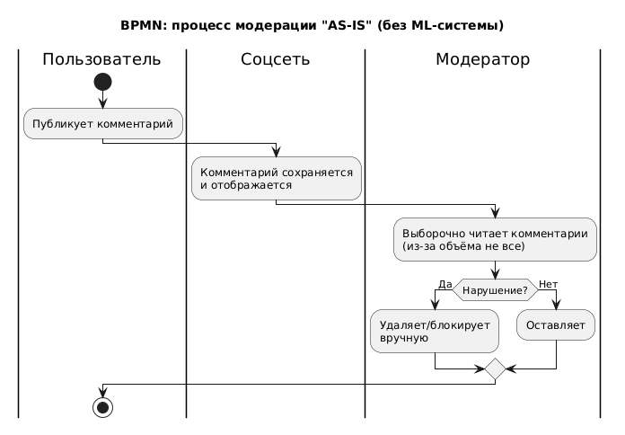
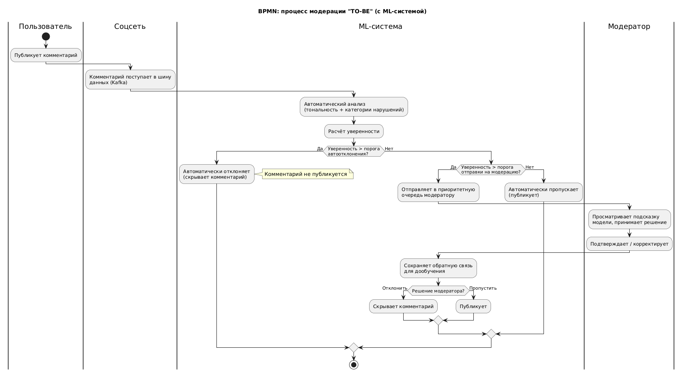
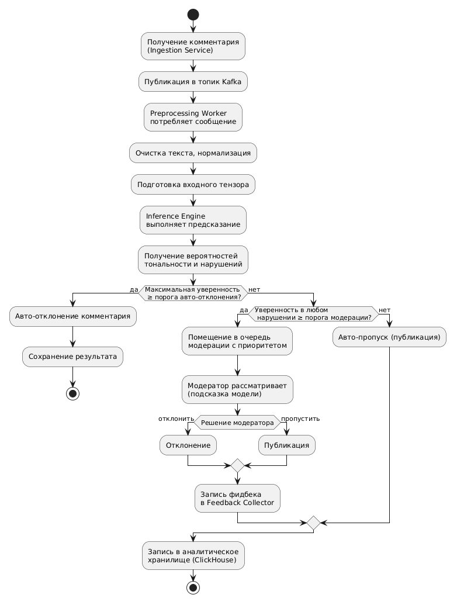
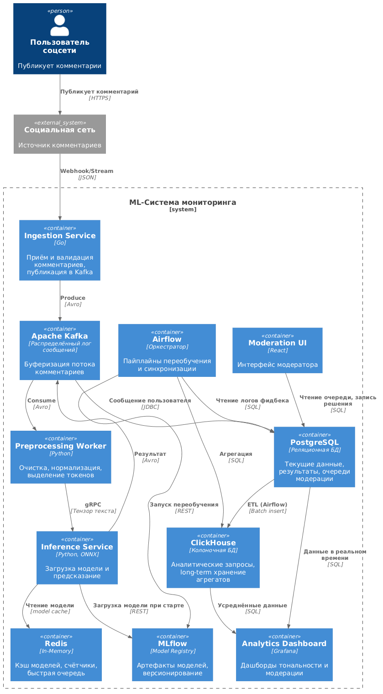
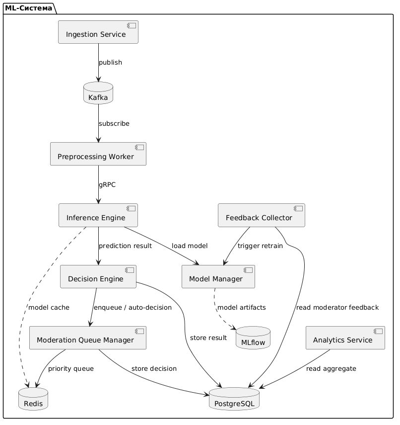
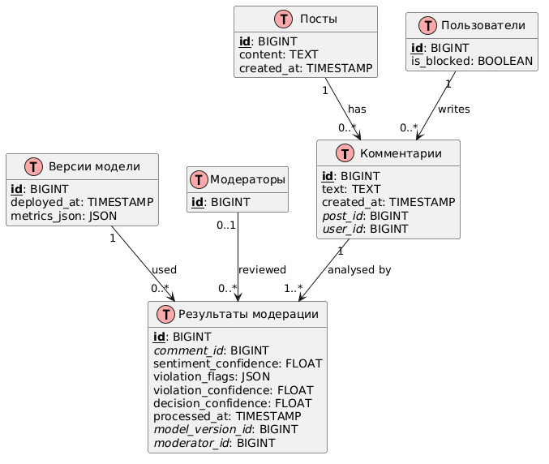

# Проектирование ML-системы для автоматического мониторинга тональности комментариев

## 1. Цели и предпосылки

### 1.1. Зачем идем в разработку продукта?
Текущий ручной мониторинг тональности и модерация комментариев (до 500 тыс. ед./день) являются узким местом бизнеса:
- **Низкая скорость**: модераторы выборочно читают лишь часть комментариев, остальное остается без контроля.
- **Высокая стоимость**: содержание штата модераторов для такого объема экономически неэффективно.
- **Субъективность**: разные модераторы по-разному оценивают один и тот же контент.
- **Риск санкций**: РКН отслеживает качество модерации, наличие неприемлемого контента грозит серьезными штрафами и блокировками.
- **Потеря вовлеченности**: без своевременного выявления негативных трендов невозможно оперативно корректировать контентную стратегию.

Автоматизация с помощью ML позволит решить эти проблемы.

### 1.2. Почему станет лучше от использования ML?
- **Полнота охвата**: каждый комментарий будет проанализирован, а не выборочно.
- **Скорость**: анализ занимает доли секунды, позволяя реагировать в реальном времени (Real-Time Moderation).
- **Объективность и воспроизводимость**: модель применяет единые критерии, исключая человеческий фактор и субъективность.
- **Экономия**: сокращение ручного труда, переориентация модераторов на сложные кейсы.
- **Предиктивная аналитика**: накопление данных о тональности позволяет выявлять тренды, прогнозировать «вспышки» негатива и упреждать репутационные риски.
- **Соответствие требованиям РКН**: автоматическое обнаружение потенциально неприемлемых комментариев с высоким recall, что минимизирует риски штрафов.

[BPMN: процесс модерации "AS-IS" (без ML-системы)](https://www.processon.io/plantuml?editor_content=2koLHlSQbzpHg8XYnjWRCYphx300qHLZMr5VP42wTl34qRm94sVXK4YbxBRAEJVMmhGhijFoplRBoTIRXs3f9Hu67aTCoAW5cylYLrsE2NXartNvorpzAhfEqso9D6cb9Xj6ACaRkXT7tb5X3rzIisPzMeKKtcWkM5zqzAq5iIuPjallzzpHBueIpyHPumO8GXK3b7yRhGWjfD0CBTom196AaJCbiAjKFyQceKV0gMHT279AewbzIWtEK7nnpKi8Goy5DBQHagKzwFnG2gjfvaQ1HaHNKi1xwcIQmu9nb3B9kGH0Y5N1R4jT3rYEo1BgR2qvRzL1q4jELiZRpBSxPG5YNXyjLLF5SNQog6N3zwpfg6r9LZueyrteWiyLjl0tqqoEJcfowINnjHhxQ4UzvGvBUM5phrxVn1ywX4WZWj0Zs5xgkBX2gzr7dbfAacmZGu3ur6PAccH5tfoecz1m)

[BPMN: процесс модерации "TO-BE" (с ML-системой)](https://www.processon.io/plantuml?editor_content=91SzJPquqD77RN7RuTlfVOxqIclkWhKxGaPi1Q9QJLPs0irj9Q65EuL3RJUtwjmKhLr6A5o7P53XqpH90STga8CmNBfcIcqYtuAldU4dP0RoYb2moxKwrj5HXLgr5TjMX6Hl3LXTCW3isBxHytqqtCkDQToP6PPOzcrDQQUeasfvWJP865wVEuEpRiT3VGke8CveNhhhW2D7hobShHi7nUEFL0dVcg3KqlIhTLXvqq4NHD9yNGUoVLocYmSSHCXhCda1UY1GI7CxgwsqkXyDOlcRPqZSF9ekOTg7VCdUrD3pnKNpfKahuCsQh3V7LyDt1cMlNZYSdXFIG17huZXiwryuKAVlke6jQF6V5yE4TjEsm93ZzFcKlA6qA9Mr5kNFWvyiMxcGQHrT5axLnJiaTL8PYoNqzpm8gSKaNyvP8h7TbFRYEfpM5Smloqt8PV66KvOVdoi6tfVU5eIC53BlvJJ5VR0LhPR97XuiC75qKbKs7a8MXTfxhKoJiN8XP9bOYqrU7uVSwHYo4QNS7IcgjPH2NIGwRBevqhYvfeoQZOochUu1QrSBZtYPjsY67AX8j3yNATvMQySLDMpmPZIw4fSUz3TKVcpOWYdVFTj4h8haenQ5UjZrimZz1ARnF545WAY7Z1wAPtLqoiD9MGDr9oJprK5mzPxIhX7NJfdG5CnGDSHUNAMBclsCT8o78QbYzJiSLf2YGiKtflQ6FnfAy6stAhX2SiIJ0V05qvqS56jIwrUT4WDUWurlQy3sScOZ6BdrGsdPIxOl0eIOgE6F4jjjgDLokuPq3jSKNS6V3eRqJFj8y7eBY1D3qUjAUaS1cyAehJ7hz1HzlHifpN9x3CE175jI)

*Акцент изменений: ручной выборочный просмотр заменен сплошным автоматическим анализом с интеллектуальной маршрутизацией. Модератор работает только со сложными случаями, что радикально повышает скорость и покрытие.*

### 1.3. Бизнес-требования и ограничения
**Бизнес-требования:**
- B1. Снизить долю неприемлемых комментариев, не отмодерированных в течение 1 часа, до <0.1%.
- B2. Сократить время реакции на негативный тренд (от появления поста с высокой долей негатива до оповещения контент-менеджера) до 5 минут.
- B3. Снизить затраты на ручную модерацию на 40% в течение первого года.
- B4. Предоставлять регулярную аналитику по тональности для улучшения контентной стратегии.
- B5. Обеспечить юридически значимый аудит действий модели для РКН.

**Ограничения:**
- O1. Бюджет на развертывание и поддержку инфраструктуры ограничен (нельзя использовать дорогие GPU-фермы без обоснования окупаемости).
- O2. Данные не должны покидать контур компании (требование ИБ, возможна работа с чувствительными ПДн).
- O3. Законодательные ограничения: критерии неприемлемого контента регулируются РКН, модель должна регулярно адаптироваться к изменениям.
- O4. Пропускная способность системы должна выдерживать пики (например, до 50 комментариев/сек).

### 1.4. Функциональные требования (FR) и нефункциональные требования (NFR)
**FR:**
- FR1. Автоматически классифицировать каждый входящий комментарий по тональности: позитивная, негативная, нейтральная.
- FR2. Автоматически выявлять категории нарушений: оскорбления, разжигание ненависти, спам, угрозы, нецензурная лексика, контент 18+ и пр. (multi-label классификация).
- FR3. На основе уверенности модели принимать решение: «пропустить», «отклонить автоматически», «отправить на ручную модерацию» (с приоритетом).
- FR4. Предоставить модераторам интерфейс очереди с приоритезацией и подсказками модели.
- FR5. Собирать обратную связь от модераторов (подтверждение/корректировка решений) для дообучения.
- FR6. Дашборд аналитики: распределение тональности в динамике, топ постов с негативом, статистика по типам нарушений, эффективность модерации.

**NFR:**
- NFR1. **Производительность**: обработка 99% сообщений за время <= 200 мс (без учета задержек очереди).
- NFR2. **Масштабируемость**: горизонтальное масштабирование компонентов без остановки сервиса.
- NFR3. **Доступность**: uptime системы классификации >= 99.9%, деградация до ручного режима при полном отказе.
- NFR4. **Безопасность**: шифрование в транзите и хранении, аудит доступа, маскирование чувствительных данных.
- NFR5. **Интерпретируемость**: возможность объяснить решение модели (например, через LIME/SHAP) для модераторов и аудита.
- NFR6. **Журналирование**: все предсказания и решения должны сохраняться с метаданными для будущих проверок РКН.

### 1.5. Процесс пилота и критерии успеха
**Подход к пилоту:**
Пилот запускается в одном-двух сообществах (или типах контента) с совокупным потоком ~10–20 тыс. комментариев/день. Система работает параллельно с текущим ручным процессом (silent mode): все комментарии проходят автоматический анализ, но решения модели только записываются в лог, реальная модерация происходит как раньше. Через 2 недели сравниваются метрики.

**Критерии успеха пилота:**
1. **Полнота обнаружения нарушений**: Recall по классам «серьезные нарушения» (оскорбления, угрозы) не ниже 0.85 при Precision >= 0.70.
2. **Скорость**: 95-й перцентиль задержки обработки <= 500 мс.
3. **Покрытие**: система стабильно обрабатывает дневной объем без отказов.
4. **Сходимость с модераторами**: согласованность решений модели с решениями опытного модератора (Cohen’s Kappa >= 0.6).
5. **Снижение времени обнаружения**: автоматическая эскалация негатива сокращает среднее время реакции с >2 часов до < 10 минут в пилотной зоне.

### 1.6. Итерация MVP и технический долг
**MVP (минимально жизнеспособный продукт):**
- Классификация тональности (позитив/негатив/нейтраль) и базовый детект нарушений (оскорбления, нецензурная лексика, спам) с использованием fine-tuned модели (например, RuBERT).
- Автоматическое решение на основе порогов уверенности: «пропустить» или «отправить на модерацию».
- Простая очередь для модераторов с предзаполненным вердиктом модели.
- Сохранение результатов и обратной связи.
- Базовый дашборд с ключевыми метриками.

**Технический долг (отложено до пост-MVP):**
- Обработка сарказма, иронии, контекстных шуток.
- Multi-label с более тонкими категориями (буллинг, доксинг, дезинформация).
- Активное обучение (Active Learning) для автоматического отбора наиболее информативных примеров на разметку.
- Интеграция с системами A/B тестирования для оценки влияния модерации на вовлеченность.
- Мультиязычность (расширение на национальные языки РФ).
- Объяснение решений модели (Explainable AI).
- Система автоматического ре-тренинга с учетом дрейфа данных.

## 2. Методология

### 2.1. Техническая постановка задачи
С точки зрения ML мы решаем две взаимосвязанные задачи обработки естественного языка (NLP):
1. **Классификация тональности** – мультиклассовая (позитив, негатив, нейтраль) или регрессия на степень негативности.
2. **Детекция нарушений** – multi-label классификация (каждый комментарий может содержать несколько типов нарушений одновременно).

Дополнительно возможно использование детектора аномалий во временных рядах (внезапный всплеск негативных комментариев к конкретному посту) для раннего оповещения.

### 2.2. Необходимые данные
Без качественного набора размеченных данных задача не решается. Ключевые источники:
- **Тексты комментариев** – сырые данные из соцсети (обезличенные, если требуется).
- **Разметка тональности** – экспертная или краудсорсинговая (минимум 10–20 тыс. примеров).
- **Разметка нарушений** – экспертная в соответствии с политикой модерации и требованиями РКН. Важно обеспечить баланс классов (апсемплинг/взвешивание для редких типов).
- **Метаданные**: ID поста, ID пользователя, временная метка, (опционально) пол, возрастная группа автора.
- **Исторические логи модерации** – решения модераторов, которые можно использовать как слабую разметку (weak supervision).

### 2.3. Метрики качества ML и их связь с бизнес-результатом

| ML-метрика | Описание | Бизнес-результат |
|-----------|----------|------------------|
| **Recall для класса «серьезные нарушения»** | Доля истинных нарушений, которые модель нашла | Минимизация риска штрафов от РКН (пропуск нарушения критичен) |
| **Precision для автоматических блокировок** | Доля правильно заблокированных комментариев среди всех автоматически заблокированных | Снижение недовольства пользователей ложными банами, сохранение вовлеченности |
| **Macro F1-score (по всем классам)** | Сбалансированная мера качества классификации по всем категориям | Общая удовлетворенность модераторов подсказками системы |
| **Latency (95th percentile)** | Время обработки одного комментария | Пользователь не замечает задержки, реальное время реакции |
| **Покрытие (coverage)** | Доля автоматически обработанных комментариев без участия человека | Экономия ручного труда, масштабируемость |
| **Cohen’s Kappa** | Согласованность с эталонным модератором | Повышение доверия к системе, плавный transition |

Ключевое: бизнес-метрика «снижение количества пропущенных неприемлемых комментариев» напрямую зависит от **Recall**. При этом нельзя жертвовать **Precision**, чтобы не заблокировать безвинных пользователей. Компромисс достигается настройкой порогов уверенности и выделением «серой зоны» для ручной проверки.

### 2.4. Риски на этапе анализа и моделирования

| Риск | Вероятность | Влияние | Меры по смягчению |
|------|-------------|---------|-------------------|
| Недостаток размеченных данных, особенно для редких нарушений | Высокая | Низкое качество классификации редких классов | Краудсорсинг разметки, weak supervision из логов модераторов, data augmentation (back-translation, синонимизация). Активное обучение в MVP. |
| Дрейф концепта (изменение языка, новые типы нарушений) | Средняя | Постепенное падение качества | Непрерывный мониторинг метрик, автоматизированный пайплайн переобучения (раз в квартал или по триггеру дрейфа) с привлечением экспертов. |
| Дисбаланс классов (спама много, угроз мало) | Высокая | Модель игнорирует важные редкие случаи | Weighted loss, oversampling/undersampling, stratified sampling, Focal Loss. |
| Ложноположительные блокировки (цензура нормальных комментариев) | Средняя | Репутационные потери, отток пользователей | Настройка консервативных порогов авто-блокировки, обязательная перепроверка человеком в «серой зоне». |
| Необъяснимость решений модели | Низкая | Недоверие модераторов, невозможность аудита | Использование SHAP/LIME или встроенных attention-механизмов трансформера, отображение ключевых слов-триггеров. |
| Утечка чувствительных данных | Низкая | Штрафы, потеря репутации | Все данные внутри контура, анонимизация перед обучением, RBAC. |

## 3. Подготовка пилота

### 3.1. Способ оценки пилота
Пилот оценивается через **параллельное A/B-тестирование процессов**: группа А (без системы) и группа Б (модераторы используют систему). Метрики сравнения:
- Время закрытия инцидента (от публикации до модерации).
- Доля пропущенных нарушений (через выборочный аудит независимыми экспертами).
- Удовлетворенность модераторов (опрос SUS).
- Количество ложных срабатываний на 1000 комментариев.
- Нагрузка на модераторов (число обработанных в час).

Пилот считается успешным, если по всем ключевым метрикам наблюдается улучшение не менее 15% относительно ручного процесса без потери качества.

### 3.2. Что считаем успешным пилотом
Успех = выполнение **всех** критериев успеха из п. 1.5 в течение двух недель стабильной работы.

### 3.3. Подготовка пилота
1. **Сбор и разметка пилотного датасета**: отобрать 20 тыс. комментариев из пилотного сообщества, разметить силами 3 опытных модераторов (перекрестная проверка, разрешение конфликтов голосованием).
2. **Обучение базовой модели**: fine-tune `DeepPavlov/rubert-base-cased` или `cointegrated/rubert-tiny` на пилотном датасете.
3. **Развертывание сервиса** в docker-контейнерах на тестовом стенде с нагрузочным тестированием.
4. **Интеграция с очередью сообщений**: подключение к стриму комментариев в режиме «только чтение».
5. **Обучение модераторов**: знакомство с интерфейсом очереди, разъяснение принципов работы модели и важности обратной связи.
6. **Запуск silent-режима на 3 дня**, затем включение системы как помощника для модераторов.

[Поведенческая UML-диаграмма (Диаграмма активностей обработки комментария)](https://www.processon.io/plantuml?editor_content=5jPVQTUgGJQ6sGxTwEywo5U1GWMgAVsCxE76bHlOS90xRS9D9UYWVx41Ag9Ij72ckRho9nbCEg2doebfuvEI4Mv6nOAXQsPQLjtz8plVcaPgFhfdDbUwNErAfYaj27TvP6SAzC63VRFwFhVteAYuiuHpTPCL4uVixsrSQ4G3Qv2ArQ0dR1DQIIz0Tn7VSzljNpws3mD9cjRDYlIGX1gQxwayZQ8NRXB2tPkDigdRNTRiex4kGm2KB9dxkSB2p44nH11Ir9Xh5xmy132PDrqi5DsrpflfeSsBcj0g56TStuPPvi0eLow2fqcVEbWitY4O2D1uKzufCfjMMfDZd3U3yd027yEgilaPI2FtfH27kJznm2VpyCLLw7CKUHQyan4HxJPRecNvpHZzLz8oHR0rvZd6DsoggF2aORjdypKFxRZBlFcl2pujhDfnNssH2QixBFi0uegttBuXbdCE76ufcbtFkOXYKiXHuy2r0xd7PJgdRQTOIHf1r26hgZqGUGtoqLkwj2xHhmu9EVuFJFypf1YZMlqYaEmsgnERh6sKDmJxt4MgWKjLX3F5CtwqYRIHodpx0Q8SxrmGqQ8brvWU2vJE3aVZmWaVRmKI8UbGyoyFwF1dHtmc5wnqsksCIzMfxip2yAKxxo6TGOvGjMaddB0mV3c6vTE8DmR0Twfh5mDw4FQEjKY4R3H90brFN6rddSJkiqq9cdEQCzcVxQTmWinyKByMVQkeqWgd4ke9bfjEjO2cRt2D0tFuRgArvq7bqPIEyyrdjxptoJQZDIcFJzAofUXsdiiazGIKihfdsq1ta4QPEnKkPbrgNtv0eXssfNyv0k8hoiAMGa3mZu50BGj6x7PZF2auB13s382LXg5OJhwWxemGMx1)

*Диаграмма иллюстрирует поток управления от поступления сообщения до финального решения с участием модели и модератора.*

## 4. Внедрение для production системы

### 4.1. Архитектура решения
Общая архитектура состоит из следующих компонентов:
- **API Gateway / Load Balancer** – единая точка входа для внешних запросов.
- **Comment Ingestion Service** – принимает поток комментариев из соцсети (webhook или чтение из брокера сообщений), публикует в Kafka.
- **Kafka** – распределенный лог сообщений, обеспечивает асинхронную связь и буферизацию пиковых нагрузок.
- **Preprocessing Worker** – очистка текста, токенизация, нормализация, выделение признаков. Потребляет из Kafka, отдает в Inference Service.
- **ML Inference Service** – загружает модель, выполняет предсказание. Для масштабирования – несколько реплик за балансировщиком. Может использовать GPU или ONNX Runtime на CPU.
- **PostgreSQL (основное хранилище)** – хранит комментарии, посты, результаты классификации, действия модераторов. Расширяется read-репликами для аналитики.
- **Moderation Queue Manager** – на основе результатов модели и порогов направляет комментарий либо в автопринятие/автоотклонение, либо в очередь модератора (Redis или отдельная таблица с приоритетом).
- **Moderation UI** – веб-интерфейс, через который модераторы просматривают очередь и выносят вердикт.
- **Feedback Collector** – сохраняет решения модераторов, периодически формирует датасет для дообучения.
- **Analytics & Dashboard** – агрегирует данные по тональности и модерации, строит дашборды в реальном времени (ClickHouse для OLAP-запросов или отдельная аналитическая БД).
- **Model Registry (MLflow)** – хранилище версий моделей, метрик экспериментов.
- **Orchestrator (Airflow)** – управление пайплайнами переобучения, синхронизации с источниками.

[Диаграмма архитектуры системы (распределённое хранилище)](https://www.processon.io/plantuml?editor_content=3Nl9c8Y6YciGIBFnSGY17xWXoEcVv6s4JMZxuwn0XJnjhxBbT6vltyRcIvXd82yR9vjTkkNmvixgCLDQxAWLxhwUyJdhkFgg6KE5akG6tFeF1RpMBPDnANjjzUQSAE9x97Ef8Pi922uUwtbBAwA3YmI5wD7vxdBWWaMePshyxk9BpMuVGJDegBhGDCMRUG3AqgRALm80GEjICV3uthHNKpu10AkVgQSYVAuvQpbCtisdES6lR1MW3jzA8lZwRd5wZ6yySMWChP8PJTCVGMp5JrsppH50wczFoqH2w1FedmK2PMTNn9ix90YqejyVhKTiEIXzYrwUhK9f1pjdMSq0AfPKxN2Uzxa4Enyi7MH10qlYEKlfdIkrAPbmlWsXvtKR6tai9UezcdEWgsdWWDPsySwHUfkwS3PdhuqVfjpvFzojwWCfBCkb7A8bAcRe7A8SI4gMkvDR12hcwLW1p2qh7ApQRtpSVQ5YxDuOYm1EzSxSmcYiWIDWw5rsz3jVO1OhtEaY6rcnt0k6myDYMLv8lWO4omK3K4PO6UhH8e4WPIdYN9B5h3LhASogltjYzBc58YmQFg85jwAwnoVbPVXBimqo7HJvsKzYkfQiXdszc5tcxkVi7AvzJJjfgr7up9DLThdqZZEcWd3kdfQAA8nmpMoDUU9wH94PPrY54F1w1K3hthwcuXbJLj4IQiFoNzRgEGjJv7FopJYzRdvyKKhOnuPAGvyAROB4wGWxdSXECU99ULp039d5c6szD7ASzRGF7gcOSNKFU6SYJXQYMLrb6ieUPFEFuDsRA68TOgzuGzRmy46Wma5RhV6ZD2Zy8Pz4hW7td8aAikqHI8pAVDFJqUWPe8kx87NFHdyohxKhPIwHJvk7Vu1OI8WRwCW5uTpZBHOUMbGZL2IAuM7pqpVtnVqRprTEZJcC2Vl15o67njvQxV4DPS40gsHhPywhYzYgd4cvQQEbKgUHp7sakctiMfKzXjzkkgdeoWMvC0YugXUTwMPlaMx0uK4xjUuT1EPRNgqZ09Wt6a10ROOagtZfKQiTGkr3QaVMfjcPouxSXcDy6uzXIWX0liXFgM7AJJ68MfTgC96IUZ3xzGtoP0kuNC62nH56bXAN39Fzj8YU3nBI9XIJ9PSeP6TFzSAXJEC5BI9ZFjdYT5ztlvBr3Vhce37T5pFZZMbXMucMwgajQhDD1KHnxLW4Tdxi0CxuhF2MNONwIdsGIdWlY3BWdQCVuXR5sFXmL9uFZ2sa55tllv5pE5jGsMOJwDP9iArQ9oXuPcGwcHHNg5Q1RVKjS8ZBZbmWE3LXIbLR3kZx5QT77qidmnNuNRui5wXxzEMtpNXGdevWWklFfsElnF6hMlZZ3SA6hW81HI4uEPKaz7cQu9DDJOWqlFTeNdB1LsEqN7LqmeWo824wseQJJAmfAdz3BsZwMVpz2AZMuHZxB2YdnysNqacd39QPaH2xXqX9Zxkql2o8UAzEzzBhXuuIXMH7SjxylQq54sF6tTGhhin3ng3j7WUb9Kyu88r3aHYjiYN9HMtSIj5CPzeZR8osPunADOr3IqWVLOs4ldGg62K)

*Распределённый характер хранения обоснован: Kafka – оперативный транспорт и буфер; PostgreSQL – согласованное OLTP; ClickHouse – аналитика по большим объёмам; Redis – низколатентный доступ к моделям и очередям. Компоненты могут масштабироваться независимо.*

[Структурная UML-диаграмма компонентов](https://www.processon.io/plantuml?editor_content=jKA2YR4cWE9alF5uxUgkn2QKZJqANgh5zzPdp7W6jYXFkPgQKTi9YiZxrtuRFfKr9c47JP7MLwdNEKKMgxmgJyP94MmQg74dqFERBZxtiYy3DQhEGiYDpLgUwZ2C35nTKERdYa01HXJe3k7WX2JRmlKwd67IDE6UXx2WbGWXQ9VyoBFvToJ4bnyb47cOoAg8rOXeTzoGeH2MiKzKTd6SRXzQIcQ888iOnHcNvlSsJkCEC9J3bsGZSJhfpSt7baVFfLC2V3yigcwlQjcVG3DMbWuAWn1h1ctlWWRqtUFGOdZ2NiqY1ctzcUybZThHWdtSFlU72EYgMeI4EWHvNVckfb8qinFzLtlKZTmGyfyIOfr6QE1v3FPaAzPyM1GSzaMlsz3966EG5FsszQ9dKc2MyExgi5SHOMkxlJiXRSiZH80I85AkYZJ1KdfquShWpB0G0sVi9qM5TPBiodZzaCdOzVMrrY8eqeIIszbBTpjEC1eseuthixUer5M9P4o5dLCgJDZxCXTGQpbEaWenme94u4GnB6wDDAQ1GsPEF0Y8bw5uvDpAGAYRk0Kf0WkguWefbux)

[Диаграмма структуры данных (ER)](https://www.processon.io/plantuml?editor_content=8QbJfTfA597hRZxFWQH25n5WKjAX0mahx9619wjJcCmDhpE7G7dLzm9L1WtGxIHjnM09fRJCfkWgjqaN0dOpDFEeAtKKTolBLvsEH7nygqpPvAP1qk9TxQ6rffxBjBxhxG5etlSD6jJJIwTrIU5srh6Tqubz0dwrc0VdNTe8TSfmj91uTl6SoDoDgKKCgbcp2ge4j7PwLbwxuuRXIWxhZbgi98QJCcY9i74tMjaB7uQlRw4nbbIr1C83oLbpBhKIOyEBPUS5Ckas1fbtAUEsP16lvGtg7i77WujwAQMHwoB1Cp8y9YMKLqc5TsJZk2C6uALEO8ParMfB7zme81Dx45pF50ifvL85Yb6hLLy5xoqxg9S8qQI6qIJxguOGN7wR0J50xAmfx0tRauwnkiDinifttfq9Qdk8Bk0d1uqpGX0b1tz6KmPuws3XC3tJ7b8zlMbjpuSxMGn8k8niemj8ZwcLFS6K1J2Sh0IVWinX2p2dxf0szSQ3Gqy6bPdgwdZDN3ZmQlA8yP8DtmMQCmnlE5LkyJYOitLIr1o50E5t7sVTOiEpeBswjBIaamzpR45tQs4ftsxpn0otZvo42ltv5dNUffTK7ks6DHFREoj7rvsqH49LsgoNTYj0H5E5afhGUxbGG7c0NfS2KFNIQWhHCjueP4m0QXgfc8jAbQvhDBT0PiqfsuumY08nsZ5idRfxCbjw56LFGlwJIXgY4SG2kQiN37Pe7ITayvc7D6RlNkQJ9GdOuPUJ2dLDoljszQRMaK2096bLjj7APA6JfTE6wL2RjOkU2uVyilVws4tZzraPVq4haL3lHThsJjOJz4njzc6pge4k88krWBENyurFWwRvZP5af7edfm5paYQrHLAbOnBZRPNUOnjaioK3amO7Nvzl6TS)

*Представлена реляционная модель. Для распределённого хранения: `comments` и `moderation_results` могут быть секционированы по времени, `model_versions` и `moderators` – глобальные справочники.*

### 4.2. Инфраструктура и масштабируемость
**Выбранная инфраструктура**: Kubernetes на bare-metal или в приватном облаке (для соответствия O2). Все компоненты контейнеризированы.
- **Плюсы**: горизонтальное масштабирование, отказоустойчивость, удобное управление развертыванием, изоляция ресурсов, легкое обновление без простоя.
- **Минусы**: накладные расходы на оркестрацию, необходимость компетенций DevOps, сложность с GPU sharing (используем nodeSelector/taints для GPU-нод или только CPU инференс с оптимизированными моделями типа DistilBERT, ONNX).

Масштабирование:
- Ingestion и Preprocessing – stateless, масштабируются по числу партиций Kafka.
- Inference – HPA по загрузке CPU/GPU или длине очереди в Kafka.
- Базы данных – вертикальное масштабирование с возможностью шардирования (по ID сообщества) для PostgreSQL.

### 4.3. Требования к работе системы (SLA)
- **Availability**: сервис инференса – 99.9% (допустимый downtime не более 43 минут в месяц). При полном отказе – автоматический фолбек на ручную модерацию входящего потока.
- **RPS (Requests per Second)**: среднее – 6 rps, пиковое – 50 rps (с учетом дневного паттерна). Система должна поддерживать 3x пиковый запас.
- **Latency**: p95 < 200 мс на инференс, p99 < 500 мс. End-to-end от публикации до решения в очереди модератора – < 1 сек.
- **Точность модели**: контролируется через автоматизированный мониторинг дрейфа и переобучение по расписанию (раз в 2 недели). При падении F1 ниже порога (например, на 10% от базовой) – алерт и запуск внеочередного переобучения.

### 4.4. Риски и неопределенности

| Риск | Описание | Стратегия управления |
|------|----------|----------------------|
| **Сложность валидации соответствия РКН** | Критерии могут меняться, модель должна быстро адаптироваться | Регулярный аудит внешними юристами, возможность быстрой доразметки и дообучения (конвейер CI/CD для ML). |
| **Отказ Kafka или потеря сообщений** | Потеря комментариев для модерации недопустима | Репликация Kafka (min.insync.replicas=2), мониторинг lag, dead-letter очередь для необработанных. |
| **GPU-зависимость и стоимость** | Высокая стоимость GPU-инстансов для инференса | Применить дистилляцию модели (RuBERT-tiny), экспорт в ONNX с квантованием, CPU-пул как fallback. |
| **Злонамеренные действия (Adversarial attacks)** | Пользователи могут обходить фильтры, заменяя символы | Предобработка с нормализацией текста, регулярное обновление правил, ансамбль с классическими моделями (наивный байес с n-граммами) для подстраховки. |
| **Психологическая нагрузка на модераторов** | Система может увеличить поток «серых» комментариев, перегружая людей | Тщательная настройка порогов отправки на модерацию, мониторинг загрузки, ротация, регулярные перерывы. |
| **Утечка модели** | Веса модели – интеллектуальная собственность, утечка может раскрыть алгоритмы обхода | Хранение в защищенном Model Registry, доступ по токенам, audit log. |

---

## Диаграммы (PlantUML)

### 1. Модели бизнес-процессов до и после внедрения (BPMN)

[BPMN: процесс модерации "AS-IS" (без ML-системы)](https://www.processon.io/plantuml?editor_content=2koLHlSQbzpHg8XYnjWRCYphx300qHLZMr5VP42wTl34qRm94sVXK4YbxBRAEJVMmhGhijFoplRBoTIRXs3f9Hu67aTCoAW5cylYLrsE2NXartNvorpzAhfEqso9D6cb9Xj6ACaRkXT7tb5X3rzIisPzMeKKtcWkM5zqzAq5iIuPjallzzpHBueIpyHPumO8GXK3b7yRhGWjfD0CBTom196AaJCbiAjKFyQceKV0gMHT279AewbzIWtEK7nnpKi8Goy5DBQHagKzwFnG2gjfvaQ1HaHNKi1xwcIQmu9nb3B9kGH0Y5N1R4jT3rYEo1BgR2qvRzL1q4jELiZRpBSxPG5YNXyjLLF5SNQog6N3zwpfg6r9LZueyrteWiyLjl0tqqoEJcfowINnjHhxQ4UzvGvBUM5phrxVn1ywX4WZWj0Zs5xgkBX2gzr7dbfAacmZGu3ur6PAccH5tfoecz1m)

[BPMN: процесс модерации "TO-BE" (с ML-системой)](https://www.processon.io/plantuml?editor_content=91SzJPquqD77RN7RuTlfVOxqIclkWhKxGaPi1Q9QJLPs0irj9Q65EuL3RJUtwjmKhLr6A5o7P53XqpH90STga8CmNBfcIcqYtuAldU4dP0RoYb2moxKwrj5HXLgr5TjMX6Hl3LXTCW3isBxHytqqtCkDQToP6PPOzcrDQQUeasfvWJP865wVEuEpRiT3VGke8CveNhhhW2D7hobShHi7nUEFL0dVcg3KqlIhTLXvqq4NHD9yNGUoVLocYmSSHCXhCda1UY1GI7CxgwsqkXyDOlcRPqZSF9ekOTg7VCdUrD3pnKNpfKahuCsQh3V7LyDt1cMlNZYSdXFIG17huZXiwryuKAVlke6jQF6V5yE4TjEsm93ZzFcKlA6qA9Mr5kNFWvyiMxcGQHrT5axLnJiaTL8PYoNqzpm8gSKaNyvP8h7TbFRYEfpM5Smloqt8PV66KvOVdoi6tfVU5eIC53BlvJJ5VR0LhPR97XuiC75qKbKs7a8MXTfxhKoJiN8XP9bOYqrU7uVSwHYo4QNS7IcgjPH2NIGwRBevqhYvfeoQZOochUu1QrSBZtYPjsY67AX8j3yNATvMQySLDMpmPZIw4fSUz3TKVcpOWYdVFTj4h8haenQ5UjZrimZz1ARnF545WAY7Z1wAPtLqoiD9MGDr9oJprK5mzPxIhX7NJfdG5CnGDSHUNAMBclsCT8o78QbYzJiSLf2YGiKtflQ6FnfAy6stAhX2SiIJ0V05qvqS56jIwrUT4WDUWurlQy3sScOZ6BdrGsdPIxOl0eIOgE6F4jjjgDLokuPq3jSKNS6V3eRqJFj8y7eBY1D3qUjAUaS1cyAehJ7hz1HzlHifpN9x3CE175jI)

*Акцент изменений: ручной выборочный просмотр заменен сплошным автоматическим анализом с интеллектуальной маршрутизацией. Модератор работает только со сложными случаями, что радикально повышает скорость и покрытие.*

### 2. Диаграмма структуры данных (ER)

[Диаграмма структуры данных (ER)](https://www.processon.io/plantuml?editor_content=8QbJfTfA597hRZxFWQH25n5WKjAX0mahx9619wjJcCmDhpE7G7dLzm9L1WtGxIHjnM09fRJCfkWgjqaN0dOpDFEeAtKKTolBLvsEH7nygqpPvAP1qk9TxQ6rffxBjBxhxG5etlSD6jJJIwTrIU5srh6Tqubz0dwrc0VdNTe8TSfmj91uTl6SoDoDgKKCgbcp2ge4j7PwLbwxuuRXIWxhZbgi98QJCcY9i74tMjaB7uQlRw4nbbIr1C83oLbpBhKIOyEBPUS5Ckas1fbtAUEsP16lvGtg7i77WujwAQMHwoB1Cp8y9YMKLqc5TsJZk2C6uALEO8ParMfB7zme81Dx45pF50ifvL85Yb6hLLy5xoqxg9S8qQI6qIJxguOGN7wR0J50xAmfx0tRauwnkiDinifttfq9Qdk8Bk0d1uqpGX0b1tz6KmPuws3XC3tJ7b8zlMbjpuSxMGn8k8niemj8ZwcLFS6K1J2Sh0IVWinX2p2dxf0szSQ3Gqy6bPdgwdZDN3ZmQlA8yP8DtmMQCmnlE5LkyJYOitLIr1o50E5t7sVTOiEpeBswjBIaamzpR45tQs4ftsxpn0otZvo42ltv5dNUffTK7ks6DHFREoj7rvsqH49LsgoNTYj0H5E5afhGUxbGG7c0NfS2KFNIQWhHCjueP4m0QXgfc8jAbQvhDBT0PiqfsuumY08nsZ5idRfxCbjw56LFGlwJIXgY4SG2kQiN37Pe7ITayvc7D6RlNkQJ9GdOuPUJ2dLDoljszQRMaK2096bLjj7APA6JfTE6wL2RjOkU2uVyilVws4tZzraPVq4haL3lHThsJjOJz4njzc6pge4k88krWBENyurFWwRvZP5af7edfm5paYQrHLAbOnBZRPNUOnjaioK3amO7Nvzl6TS)

*Представлена реляционная модель. Для распределённого хранения: `comments` и `moderation_results` могут быть секционированы по времени, `model_versions` и `moderators` – глобальные справочники.*

### 3. Диаграмма архитектуры системы (распределённое хранилище)

[Диаграмма архитектуры системы (распределённое хранилище)](https://www.processon.io/plantuml?editor_content=3Nl9c8Y6YciGIBFnSGY17xWXoEcVv6s4JMZxuwn0XJnjhxBbT6vltyRcIvXd82yR9vjTkkNmvixgCLDQxAWLxhwUyJdhkFgg6KE5akG6tFeF1RpMBPDnANjjzUQSAE9x97Ef8Pi922uUwtbBAwA3YmI5wD7vxdBWWaMePshyxk9BpMuVGJDegBhGDCMRUG3AqgRALm80GEjICV3uthHNKpu10AkVgQSYVAuvQpbCtisdES6lR1MW3jzA8lZwRd5wZ6yySMWChP8PJTCVGMp5JrsppH50wczFoqH2w1FedmK2PMTNn9ix90YqejyVhKTiEIXzYrwUhK9f1pjdMSq0AfPKxN2Uzxa4Enyi7MH10qlYEKlfdIkrAPbmlWsXvtKR6tai9UezcdEWgsdWWDPsySwHUfkwS3PdhuqVfjpvFzojwWCfBCkb7A8bAcRe7A8SI4gMkvDR12hcwLW1p2qh7ApQRtpSVQ5YxDuOYm1EzSxSmcYiWIDWw5rsz3jVO1OhtEaY6rcnt0k6myDYMLv8lWO4omK3K4PO6UhH8e4WPIdYN9B5h3LhASogltjYzBc58YmQFg85jwAwnoVbPVXBimqo7HJvsKzYkfQiXdszc5tcxkVi7AvzJJjfgr7up9DLThdqZZEcWd3kdfQAA8nmpMoDUU9wH94PPrY54F1w1K3hthwcuXbJLj4IQiFoNzRgEGjJv7FopJYzRdvyKKhOnuPAGvyAROB4wGWxdSXECU99ULp039d5c6szD7ASzRGF7gcOSNKFU6SYJXQYMLrb6ieUPFEFuDsRA68TOgzuGzRmy46Wma5RhV6ZD2Zy8Pz4hW7td8aAikqHI8pAVDFJqUWPe8kx87NFHdyohxKhPIwHJvk7Vu1OI8WRwCW5uTpZBHOUMbGZL2IAuM7pqpVtnVqRprTEZJcC2Vl15o67njvQxV4DPS40gsHhPywhYzYgd4cvQQEbKgUHp7sakctiMfKzXjzkkgdeoWMvC0YugXUTwMPlaMx0uK4xjUuT1EPRNgqZ09Wt6a10ROOagtZfKQiTGkr3QaVMfjcPouxSXcDy6uzXIWX0liXFgM7AJJ68MfTgC96IUZ3xzGtoP0kuNC62nH56bXAN39Fzj8YU3nBI9XIJ9PSeP6TFzSAXJEC5BI9ZFjdYT5ztlvBr3Vhce37T5pFZZMbXMucMwgajQhDD1KHnxLW4Tdxi0CxuhF2MNONwIdsGIdWlY3BWdQCVuXR5sFXmL9uFZ2sa55tllv5pE5jGsMOJwDP9iArQ9oXuPcGwcHHNg5Q1RVKjS8ZBZbmWE3LXIbLR3kZx5QT77qidmnNuNRui5wXxzEMtpNXGdevWWklFfsElnF6hMlZZ3SA6hW81HI4uEPKaz7cQu9DDJOWqlFTeNdB1LsEqN7LqmeWo824wseQJJAmfAdz3BsZwMVpz2AZMuHZxB2YdnysNqacd39QPaH2xXqX9Zxkql2o8UAzEzzBhXuuIXMH7SjxylQq54sF6tTGhhin3ng3j7WUb9Kyu88r3aHYjiYN9HMtSIj5CPzeZR8osPunADOr3IqWVLOs4ldGg62K)

*Распределённый характер хранения обоснован: Kafka – оперативный транспорт и буфер; PostgreSQL – согласованное OLTP; ClickHouse – аналитика по большим объёмам; Redis – низколатентный доступ к моделям и очередям. Компоненты могут масштабироваться независимо.*

### 4. Структурная UML-диаграмма компонентов

[Структурная UML-диаграмма компонентов](https://www.processon.io/plantuml?editor_content=jKA2YR4cWE9alF5uxUgkn2QKZJqANgh5zzPdp7W6jYXFkPgQKTi9YiZxrtuRFfKr9c47JP7MLwdNEKKMgxmgJyP94MmQg74dqFERBZxtiYy3DQhEGiYDpLgUwZ2C35nTKERdYa01HXJe3k7WX2JRmlKwd67IDE6UXx2WbGWXQ9VyoBFvToJ4bnyb47cOoAg8rOXeTzoGeH2MiKzKTd6SRXzQIcQ888iOnHcNvlSsJkCEC9J3bsGZSJhfpSt7baVFfLC2V3yigcwlQjcVG3DMbWuAWn1h1ctlWWRqtUFGOdZ2NiqY1ctzcUybZThHWdtSFlU72EYgMeI4EWHvNVckfb8qinFzLtlKZTmGyfyIOfr6QE1v3FPaAzPyM1GSzaMlsz3966EG5FsszQ9dKc2MyExgi5SHOMkxlJiXRSiZH80I85AkYZJ1KdfquShWpB0G0sVi9qM5TPBiodZzaCdOzVMrrY8eqeIIszbBTpjEC1eseuthixUer5M9P4o5dLCgJDZxCXTGQpbEaWenme94u4GnB6wDDAQ1GsPEF0Y8bw5uvDpAGAYRk0Kf0WkguWefbux)

### 5. Поведенческая UML-диаграмма (Диаграмма активностей обработки комментария)

[Поведенческая UML-диаграмма (Диаграмма активностей обработки комментария)](https://www.processon.io/plantuml?editor_content=5jPVQTUgGJQ6sGxTwEywo5U1GWMgAVsCxE76bHlOS90xRS9D9UYWVx41Ag9Ij72ckRho9nbCEg2doebfuvEI4Mv6nOAXQsPQLjtz8plVcaPgFhfdDbUwNErAfYaj27TvP6SAzC63VRFwFhVteAYuiuHpTPCL4uVixsrSQ4G3Qv2ArQ0dR1DQIIz0Tn7VSzljNpws3mD9cjRDYlIGX1gQxwayZQ8NRXB2tPkDigdRNTRiex4kGm2KB9dxkSB2p44nH11Ir9Xh5xmy132PDrqi5DsrpflfeSsBcj0g56TStuPPvi0eLow2fqcVEbWitY4O2D1uKzufCfjMMfDZd3U3yd027yEgilaPI2FtfH27kJznm2VpyCLLw7CKUHQyan4HxJPRecNvpHZzLz8oHR0rvZd6DsoggF2aORjdypKFxRZBlFcl2pujhDfnNssH2QixBFi0uegttBuXbdCE76ufcbtFkOXYKiXHuy2r0xd7PJgdRQTOIHf1r26hgZqGUGtoqLkwj2xHhmu9EVuFJFypf1YZMlqYaEmsgnERh6sKDmJxt4MgWKjLX3F5CtwqYRIHodpx0Q8SxrmGqQ8brvWU2vJE3aVZmWaVRmKI8UbGyoyFwF1dHtmc5wnqsksCIzMfxip2yAKxxo6TGOvGjMaddB0mV3c6vTE8DmR0Twfh5mDw4FQEjKY4R3H90brFN6rddSJkiqq9cdEQCzcVxQTmWinyKByMVQkeqWgd4ke9bfjEjO2cRt2D0tFuRgArvq7bqPIEyyrdjxptoJQZDIcFJzAofUXsdiiazGIKihfdsq1ta4QPEnKkPbrgNtv0eXssfNyv0k8hoiAMGa3mZu50BGj6x7PZF2auB13s382LXg5OJhwWxemGMx1)

*Диаграмма иллюстрирует поток управления от поступления сообщения до финального решения с участием модели и модератора.*